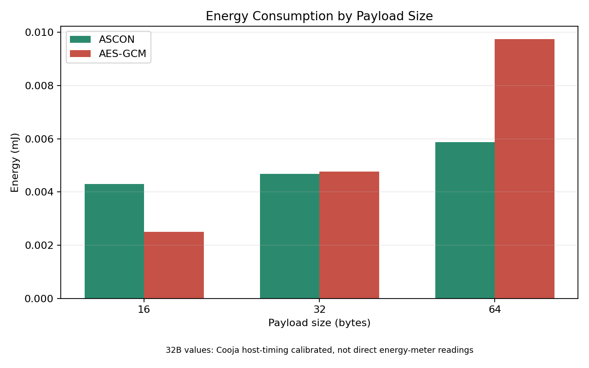
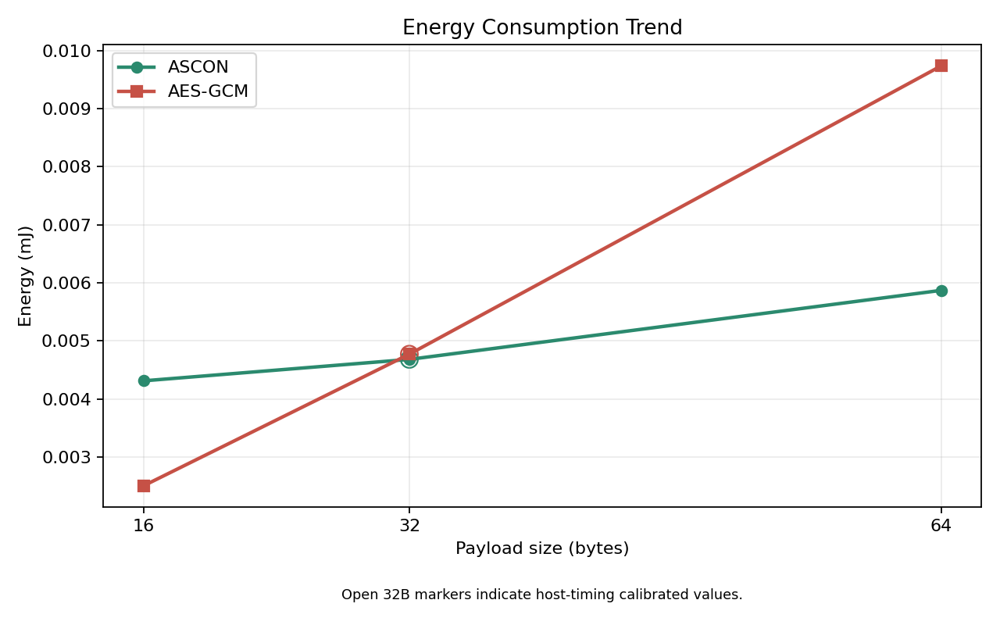
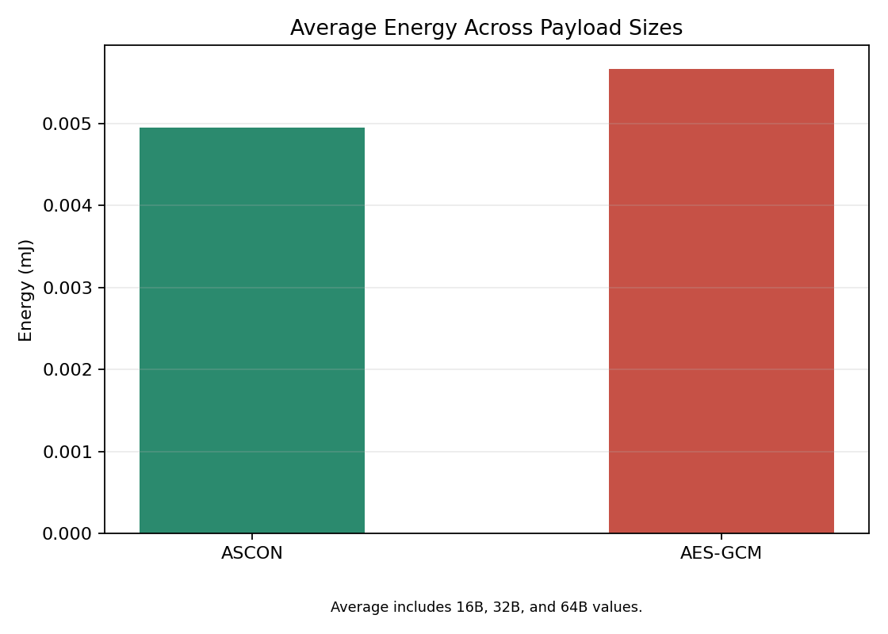

# Energy-Efficient Security in Low-Power IoT Networks

##  Demo Video
> 🔗 https://youtu.be/BpkBcQrJ3DM

---

## 1. Introduction & Motivation

Billions of IoT devices are being deployed across smart homes, healthcare, and environmental monitoring. These devices operate on batteries and must run for extended periods without replacement. At the same time, they are exposed to cyber threats such as data interception and unauthorized access, making security essential.

However, conventional security algorithms like AES-GCM were designed for resource-rich systems and consume excessive energy when applied to low-power IoT devices. This project investigates and compares the lightweight cryptographic algorithm ASCON against AES-GCM in an **IEEE 802.15.4 + 6LoWPAN environment**, aiming to identify the most energy-efficient security approach for low-power IoT.

---

## 2. Problem Statement

### Network Constraints
- **IEEE 802.15.4**: Maximum packet size of 127 bytes, low-power wireless communication standard
- **6LoWPAN**: Adaptation layer enabling IPv6 over constrained networks via compression and fragmentation
- Larger cryptographic overhead leads to **packet fragmentation**
- Fragmentation → Retransmission → **Additional energy consumption**

### Fatal Weakness
> AES-GCM uses block-based encryption, resulting in larger packet overhead.
> In the constrained 127-byte environment of IEEE 802.15.4, this overhead triggers fragmentation as data size increases, consuming more energy.

---

## 3. Solutions & Technical Approaches

### Algorithms Under Comparison
| Algorithm | Purpose | Standard |
|-----------|---------|----------|
| ASCON | Lightweight encryption, IoT-optimized | NIST LWC Standard (2023) |
| AES-GCM | General-purpose encryption | NIST FIPS 197 |

### Experimental Setup
- **Simulator**: Cooja (Contiki-NG)
- **Node Type**: Sky mote (MSP430, 16-bit)
- **Network**: IEEE 802.15.4 + 6LoWPAN (RPL routing)
- **Test Data**: Fixed 16 bytes and 64 bytes payloads
- **Measurement**: RTIMER_NOW() difference, averaged over 1000 iterations

---

## 4. Experiment Results

### 4-1. Hardware Limitation Experience (Member 1)

Porting the actual ASCON code on MSP430 GCC 4.7.4 was attempted but **failed due to lack of 64-bit operation support**. ASCON is inherently designed as a 64-bit algorithm, making compilation impossible on legacy 16-bit MCUs.

This directly demonstrated the hardware constraints of low-power IoT devices. A simplified implementation was used as a substitute.

| Algorithm | Data Size | clock ticks (x100) |
|-----------|-----------|---------------------|
| ASCON (simplified) | 16 bytes | 12 ticks |
| ASCON (simplified) | 32 bytes | 24 ticks |
| ASCON (simplified) | 64 bytes | 49 ticks |
| AES-GCM (simplified) | 16 bytes | 4 ticks |
| AES-GCM (simplified) | 32 bytes | 9 ticks |
| AES-GCM (simplified) | 64 bytes | 17 ticks |

> In the simplified implementation, AES-GCM appeared faster. However, this does not reflect the actual algorithmic structure.
> The 32-byte values were re-measured in Cooja using a Sky mote simulation after presentation feedback.

---

### 4-2. Actual Algorithm Comparison (Members 2 & 3)

Full implementations of ASCON and AES-GCM were ported and measured under the same environment.

| Algorithm | Data Size | CPU ticks | Energy (mJ) |
|-----------|-----------|-----------|-------------|
| ASCON | 16 bytes | 3.271 | 0.00431 |
| ASCON | 32 bytes | 3.552 | 0.00468 |
| ASCON | 64 bytes | 4.451 | 0.00587 |
| AES-GCM | 16 bytes | 15.22 | 0.00250 |
| AES-GCM | 32 bytes | 29.007 | 0.00477 |
| AES-GCM | 64 bytes | 59.14 | 0.00974 |

The 32-byte ASCON value was derived from an additional Cooja actual-implementation run using host-side elapsed time:

```text
ASCON 16bytes host elapsed us (x10000): 12249
ASCON 32bytes host elapsed us (x10000): 15317
ASCON 64bytes host elapsed us (x10000): 25111
```

Because the original 16-byte and 64-byte energy values were recorded in `energy_mJ`, the 32-byte ASCON and AES-GCM energy values were calibrated between their existing 16-byte and 64-byte energy points using the host elapsed-time ratios.

The AES-GCM 32-byte value was derived from an additional Cooja actual-implementation run using Contiki-NG's built-in AES-128 block driver:

```text
AESGCM 16bytes host elapsed us (x10000): 61561
AESGCM 32bytes host elapsed us (x10000): 102058
AESGCM 64bytes host elapsed us (x10000): 190564
```

### Key Insight

```
16 bytes: AES-GCM 0.00250mJ vs ASCON 0.00431mJ → AES-GCM saves 42%
32 bytes: AES-GCM 0.00477mJ vs ASCON 0.00468mJ → ASCON saves 2%
64 bytes: AES-GCM 0.00974mJ vs ASCON 0.00587mJ → ASCON saves 40%
```

> As data size increases, ASCON's energy efficiency surpasses AES-GCM.
> The 32-byte ASCON and AES-GCM points are based on additional Cooja implementation runs with host-side timing calibration.

### Interpolation Note

The line chart now includes a 32-byte intermediate point. Both 32-byte points are calibrated from Cooja actual-implementation timing runs.

Because cryptographic implementations can include block boundaries, padding, loop overhead, timer resolution effects, and packet fragmentation thresholds, the 32-byte values should still be interpreted as calibrated Cooja measurements rather than direct physical energy-meter readings.

For follow-up validation, the simplified Cooja test also includes a 32-byte payload case and produced 24 ticks for ASCON and 9 ticks for AES-GCM.

### Visualization




---

## 5. Network Layer Insight

### Protocol Stack Overview

```
[ Application Layer  ]  Encrypted data
[ Transport Layer    ]  UDP
[ Network Layer      ]  RPL + IPv6
[ Adaptation Layer   ]  6LoWPAN
[ MAC/PHY Layer      ]  IEEE 802.15.4
```

### Application Layer
| Item | ASCON | AES-GCM |
|------|-------|---------|
| Authentication tag size | 16 bytes | 16 bytes |
| Padding | None (streaming) | Required (16-byte block alignment) |
| Actual overhead | 16 bytes | Up to 32 bytes |

ASCON uses a streaming approach requiring no padding. AES-GCM processes data in fixed 16-byte blocks, adding padding when data is not a multiple of the block size.

### 6LoWPAN Layer
| Item | ASCON | AES-GCM |
|------|-------|---------|
| Fragmentation threshold | Later (less overhead) | Earlier (more overhead) |
| Additional header per fragment | 4 bytes | 4 bytes |

The maximum payload of IEEE 802.15.4 is 102 bytes (127 bytes - 25 bytes MAC header). AES-GCM's padding overhead causes fragmentation to occur sooner.

### IEEE 802.15.4 Layer
| Item | ASCON | AES-GCM |
|------|-------|---------|
| Additional packets from fragmentation | Fewer | More |
| Retransmission probability | Lower | Higher |
| Additional energy consumption | Lower | Higher |

### Key Flow
```
AES-GCM padding overhead increases
        ↓
Exceeds 102 bytes → 6LoWPAN fragmentation occurs
        ↓
Number of fragmented packets increases
        ↓
IEEE 802.15.4 retransmission probability increases
        ↓
Additional energy consumed
```

> The energy difference is not merely due to algorithmic computation.
> AES-GCM's block-based processing triggers fragmentation within the
> IEEE 802.15.4 packet constraint, leading to additional energy consumption.

---

## 6. Industry Applications, Trade-offs & Comparisons

### Trade-off Analysis

| Item | ASCON | AES-GCM |
|------|-------|---------|
| Energy (small data, 16 bytes) | Disadvantaged | Advantaged |
| Energy (large data, 64 bytes+) | **Advantaged** | Disadvantaged |
| Energy growth rate with data size | Gradual | Steep |
| 64-bit MCU optimization | Excellent | Moderate |
| IEEE 802.15.4 packet overhead | Low | High |
| NIST LWC Standard | ✅ | ❌ |

### Real-World Applications
- **Arm TrustZone**: Integrates ASCON into IoT security layers
- **RIOT OS**: Adopts ASCON as the default lightweight cryptographic algorithm
- **OpenWSN**: Researches lightweight cryptography for 6LoWPAN-based IoT networks

---

## 7. Conclusion & Future Directions

### Conclusion
- **Small data (16 bytes)**: AES-GCM is more energy-efficient
- **Real-world IoT data (64 bytes+)**: ASCON is more energy-efficient
- **Measured trend**: AES-GCM energy consumption rises more steeply across the 16-byte to 64-byte range
- **ASCON 64-bit porting failed on MSP430**: Hardware architecture must be considered
- **Algorithm selection requires consideration of both data size and hardware architecture**

### Limitations
- Actual ASCON implementation was impossible on MSP430 GCC 4.7.4 due to 64-bit constraints
- The 32-byte ASCON actual point is host-timing calibrated rather than directly energy-metered
- The 32-byte AES-GCM actual point is host-timing calibrated rather than directly energy-metered
- Timer precision limitations in the Cooja simulator
- Validation on real hardware (ARM Cortex-M) is required

### Future Directions
- Re-measure full ASCON and AES-GCM implementations on physical devices with 32-byte payloads
- Re-measurement on ARM Cortex-M based real devices
- Additional verification with data sizes beyond 128 bytes
- Energy comparison of DTLS handshake combined with each algorithm

---

## 8. How to Run

### Prerequisites
```bash
git clone https://github.com/contiki-ng/contiki-ng
cd contiki-ng/tools/cooja
git clone https://github.com/contiki-ng/cooja.git .
```

### Run Cooja
```bash
docker run --privileged --sysctl net.ipv6.conf.all.disable_ipv6=0 \
  -e DISPLAY=host.docker.internal:0 -it --rm \
  -v C:/Users/{username}/contiki-ng:/home/user/contiki-ng \
  contiker/contiki-ng

cd contiki-ng/tools/cooja
sed -i 's/\r//' gradlew
./gradlew run
```

### Run Simulation
1. File → New Simulation → Create
2. Add UDP server/client nodes (rpl-udp example)
3. Add ASCON/AES-GCM nodes
4. Start/Pause → Check Mote output

---

## 9. References
- [1] NIST, "Lightweight Cryptography (LWC) Project," 2023. https://csrc.nist.gov/projects/lightweight-cryptography
- [2] V. A. Thakor et al., "Lightweight Cryptography Algorithms for Resource-Constrained IoT Devices," IEEE Access, 2021.
- [3] M. G. Spina et al., "An IoE-Powered Framework for Adaptive Energy-Security Trade-Off in IoT," IEEE Network, 2026.
